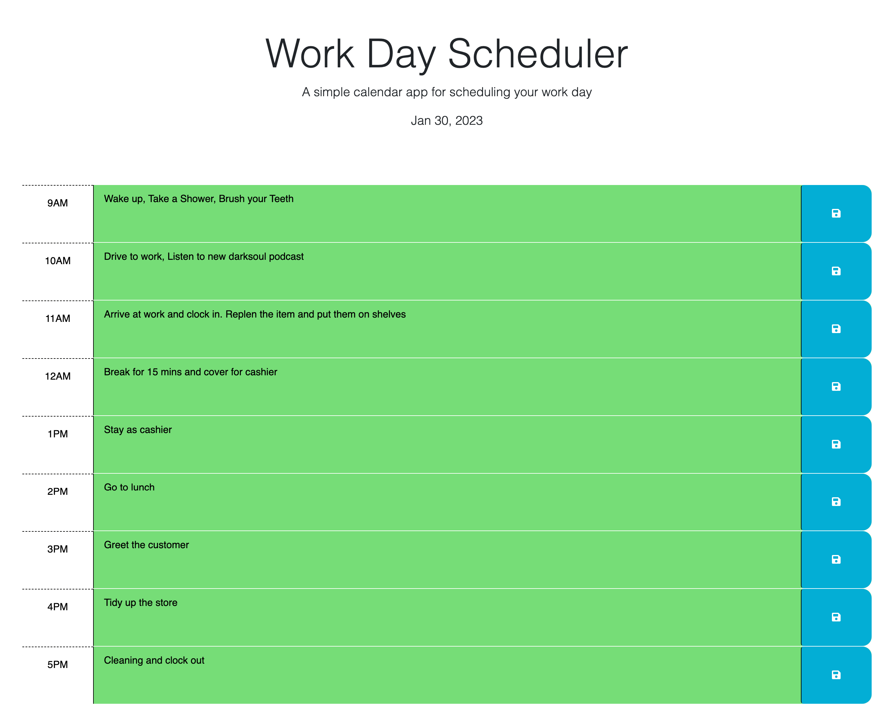

# Evening-Star-Planner

## Description
A simple calendar application that allows a user to save events for each hour of the day.

## Link
* [Evening-Star-Planner GitHub](https://github.com/JeanSuw/evening-star-planner)
* [Evening-Star-Planner website](https://jeansuw.github.io/evening-star-planner/)

## Installation
This app will run in the browser and feature dynamically updated HTML and CSS powered by jQuery. This code is built on [starter code](https://github.com/coding-boot-camp/crispy-octo-meme).

## Usage
This planner allows you to edit any events whether it is in the past, present, or future for accuracy. Time spans is from 9 am to 5pm.

Time block color indicators
* Gray: Past
* Red: Present
* Green: Future

## Acknowledge
Without these guidances, this project would not function.

* [Bootstrap Text-alighment](https://getbootstrap.com/docs/5.3/components/card/#text-alignment)
* [jQuery on() method](https://www.w3schools.com/jquery/event_on.asp)
* [Difference between $(this) and ‘this’ in jQuery](https://www.geeksforgeeks.org/difference-between-this-and-this-in-jquery/)
* [jQuery Siblings](https://www.w3schools.com/jquery/traversing_siblings.asp)
* [Day.js Hour](https://day.js.org/docs/en/get-set/hour)
* [Treehouse Community Use for loop in jQuery instead of $.each()?
](https://teamtreehouse.com/community/use-for-loop-in-jquery-instead-of-each)
* [CSS Attribute selectors](https://developer.mozilla.org/en-US/docs/Web/CSS/Attribute_selectors)
* 02-Advanced-CSS/24-Stu_CSS-Selectors
* [jQuery [attribute=value] Selector](https://www.w3schools.com/jquery/sel_attribute_equal_value.asp)
* [jQuery Attribute Contains Selector [name*=”value”]](https://api.jquery.com/attribute-contains-selector/)
* [Stack Overflow: Do you need break in switch when return is used?](https://stackoverflow.com/questions/6330114/do-you-need-break-in-switch-when-return-is-used#:~:text=Yes%2C%20you%20can%20use%20return,return%20ends%20the%20function%20execution.)